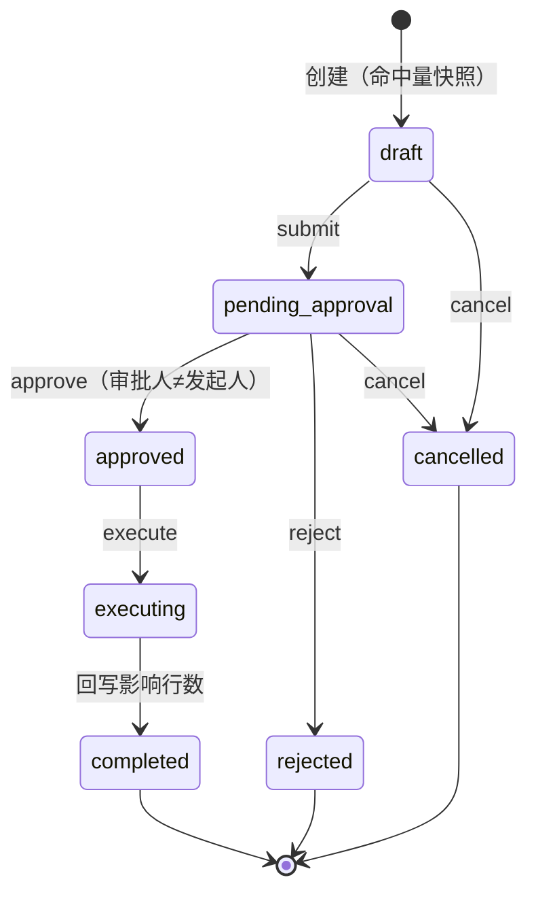

# PRD 13：数据主体权利 DSR（Data Subject Requests：查询 / 导出 / 擦除）

> 状态：Draft（简单 PRD） · 优先级：P1 · 作者：PM · 预估：后端 4d + 前端 2d
> 上游：`outputs/capability-opportunities-next-horizon.md` D1 行（17 项能力剩余 ⚪ 项之一）

## 0. 一句话定位

为 ToB 前端可观测性平台补齐"数据主体（终端用户）要求查询/导出/擦除其个人数据"的合规工单闭环——这是面向欧盟（GDPR 第 15/17 条）与国内（PIPL）大客户采购评审的**必答项**，不是 Nice-to-have。

## 1. 背景与现状锚点（代码核实结论）

- 现状缺口：`adr-privacy-collection-layer.md` 脱敏层（`redact`/`maskPhone`）与访问等级（07）只覆盖"**采集时**最小化"与"**查看时**裁剪"，没有任何"数据主体权利响应"工作流——导出散落在普通分析页（worker.js `exportCsv`，`/api/export/(events|issues|replays).csv`），**无擦除能力、无审批、无审计**。
- 已有可复用基建（本 PRD 全部写明复用关系，不重复造轮子）：
  | 基建 | 位置 | D1 复用方式 |
  |---|---|---|
  | 数据表 | `events` / `issues` / `replays` / `alert_history`（PG 与 D1 双栈同构，`app_id varchar(64)`） | DSR 命中查询 + 擦除的目标表 |
  | 导出 | worker.js `exportCsv(kind, url)` + `filters()/issueFilters()/replayFilters()` | 导出阶段直接复用（kind 限定三张表），JSON 导出复用 `filters` 组合查询 |
  | 账号/RBAC | D2 已落地：`auth` / `teams` / `session` 双栈；`packages/rbac.js`（`ROLES=['owner','admin','member','viewer']`、`hasPermission`、`roleRank`） | DSR 权限点扩展 `ROLE_MATRIX`；审批流复用"admin 及以上"判定 |
  | 能力位 | `packages/deployment-capabilities.js`（`CAPABILITY_KEYS` + `NODE_/WORKER_CAPABILITIES`，Worker env 门禁默认 false 兜底，参考 slo/synthetic 范式） | 新增 `dsr` 能力键 |
  | 前端范式 | `apps/web/src/views/monitor/` 各页（KpiGrid / MiniLineChart / OverflowTip——长文本禁用原生 show-overflow-tooltip） | `/dsr` 页面沿用 |
- 现实约束：`events` 表数据量大（Worker D1 单批查询上限 10000 行），**硬删除 vs 匿名化必须给默认决策**；`replays` 含录屏（敏感数据），DSR 必须覆盖且导出需单独授权确认。

## 2. 产品目标

1. **合规可答**：客户安全问卷中"如何响应数据主体导出/删除请求"一题，可凭平台内工单记录 + 审计日志直接举证（工单全生命周期留痕）。
2. **擦除可信且可控**：默认**匿名化**（保留统计价值的字段置空/脱敏，不物理删行，避免大表删除风暴与误操作不可逆），管理员可按工单选择硬删；执行影响行数必须可核。
3. **双人制衡**：DSR 执行必须"一管理员发起 + 另一管理员（或 owner）审批"，单人不能闭环，防内部滥用。

## 3. 用户故事

- As a **合规负责人（admin）**, I want 输入数据主体标识（邮箱/用户 ID/设备 ID/session_id 任一）即预览其在 events/issues/replays 中的命中量, so that 我能在回复用户前确认平台持有哪些数据。
- As a **合规负责人（admin）**, I want 一键生成该主体的导出包（CSV/JSON，分表打包）, so that 我能在 GDPR 15 条要求的期限内交付数据副本。
- As a **合规负责人（admin）**, I want 发起擦除工单（默认匿名化、可选硬删）并交由第二管理员审批, so that 擦除操作可制衡、可追溯。
- As a **平台 owner**, I want 在审计日志中看到每笔 DSR 的发起人/审批人/执行人/影响行数, so that 监管检查时能完整举证。
- As a **自托管部署者**, I want Worker 部署上 DSR 默认关闭（env 门禁）, so that 未验证的合规能力不会静默暴露给存量客户。

## 4. 需求池

### P0（Must have）

| # | 需求 | 说明 |
|---|---|---|
| P0-1 | DSR 工单表 `dsr_requests`（双栈同构） | 见 §5.1；状态机 §6 |
| P0-2 | DSR 审计日志表 `dsr_audit_logs` | 谁（发起/审批/执行）+ 动作 + 影响行数 + 时间戳，独立表、只追加（append-only），不随工单删除 |
| P0-3 | 主体标识查询 + 命中量预览 | 按 subject 标识在 events/issues/replays 三表 `COUNT`，命中量写回工单快照字段 |
| P0-4 | 导出执行 | events/replays/issues CSV 复用 `exportCsv` + `filters/issueFilters/replayFilters`（追加 subject 强制过滤条件）；replays 导出需二次确认（录屏敏感） |
| P0-5 | 擦除执行（默认匿名化） | events/replays：`user_id/user_name/user_phone/device_id` 等个人字段置空或哈希替换；issues：更新聚合中的个人字段与 `affected_users`；默认匿名化，工单可勾选硬删（需审批时注明理由） |
| P0-6 | 审批流 | 发起人角色 ≥ admin；审批人须为**不同用户**且 ≥ admin；审批通过后方可执行 |
| P0-7 | 能力位 `dsr` | `CAPABILITY_KEYS` 登记；Node `true`；Worker 默认 `false`，env `DSR_ENABLED=1` 门禁（slo/synthetic 同范式），前端据此显示/隐藏入口并提示"当前部署不支持" |
| P0-8 | 前端 `/dsr` 页面 | 列表（状态/主体/时间）+ 发起向导 + 详情（命中预览、审批操作、执行结果、审计时间线），沿用 monitor 页范式与 OverflowTip |

### P1（Should have）

| # | 需求 | 说明 |
|---|---|---|
| P1-1 | 法定期限 SLA 提醒 | 工单创建后 N 天（默认 30，GDPR 一个月口径）未 completed 则列表高亮 |
| P1-2 | 执行批次化 | events 命中 > 10000 行时按主键分批匿名化，避免 D1 单查询上限与长事务 |
| P1-3 | 导出 JSON 包 | 除 CSV 外提供单主体 JSON 数据包（分表结构化，便于交付用户） |
| P1-4 | 擦除策略可配置 | team 级设置：默认匿名化/硬删、匿名化字段清单（基于 events-schema 个人字段白名单） |

### P2（Nice to have）

| # | 需求 | 说明 |
|---|---|---|
| P2-1 | 数据主体自助入口 | 受控对外链接（token 化），终端用户自助提交 DSR 请求 |
| P2-2 | DSR 模板回复 | 导出/完成通知邮件模板（GDPR 回函格式） |

### 非目标（明确不做）

- 不做跨应用/跨团队的主体数据合并（DSR 按 team 边界内执行）；
- 不做自动解析任意 PII——只覆盖既有 schema 个人字段（`user_id/user_name/user_phone/device_id/session_id`）与 `props_json/context_json` 的整字段处理，不做 props 内部 PII 挖掘（复用采集层脱敏已兜底）。

## 5. 数据模型与接口契约

### 5.1 `dsr_requests`（双栈同构，注意 `app_id varchar(64)` 对齐）

| 字段 | 类型 | 说明 |
|---|---|---|
| id | varchar(32) PK | `dsr_` + random（沿用 `random(n)`） |
| team_id | varchar(64) | 归属团队（D2） |
| app_id | varchar(64) | 目标应用；空 = 团队全应用 |
| subject_type | varchar(16) | `user_id` / `user_name` / `user_phone` / `device_id` / `session_id` |
| subject_value | varchar(256) | 主体标识原文（存储前脱敏策略待确认，见 §8） |
| request_type | varchar(16) | `access`（查询/导出）/ `erasure`（擦除） |
| mode | varchar(16) | erasure 专用：`anonymize`（默认）/ `hard_delete` |
| export_format | varchar(8) | access 专用：`csv` / `json` |
| status | varchar(24) | 状态机 §6 |
| hit_events / hit_issues / hit_replays | integer | 发起时命中量快照 |
| requested_by / approved_by / executed_by | varchar(64) | 用户 id（审批人 ≠ 发起人） |
| reject_reason | varchar(512) | 可空 |
| rows_affected_events / rows_affected_issues / rows_affected_replays | integer | 执行后回写 |
| created_at / decided_at / executed_at / completed_at | integer(ms) | 时间戳 |

### 5.2 `dsr_audit_logs`（append-only）

| 字段 | 类型 | 说明 |
|---|---|---|
| id | varchar(32) PK | |
| request_id | varchar(32) | 关联 `dsr_requests.id` |
| actor_id | varchar(64) | 操作人 |
| action | varchar(24) | `create` / `approve` / `reject` / `cancel` / `execute_export` / `execute_erasure` / `complete` |
| detail_json | text | 影响行数、过滤条件、批次游标等 |
| ts | integer(ms) | |

### 5.3 接口（Node `apps/api` 与 Worker `cloudflare/worker.js` 同路径同契约）

| 方法 | 路径 | 权限 | 说明 |
|---|---|---|---|
| POST | `/api/dsr/requests` | `dsr:create`（admin+） | 创建工单（draft），服务端同步计算命中量快照 |
| GET | `/api/dsr/requests` | `dsr:view`（admin+） | 列表，支持 status/request_type/team 过滤 |
| GET | `/api/dsr/requests/:id` | `dsr:view` | 详情（含命中预览与审计时间线） |
| POST | `/api/dsr/requests/:id/submit` | `dsr:create` | draft → pending_approval |
| POST | `/api/dsr/requests/:id/approve` | `dsr:approve`（admin+，≠发起人） | 携 `decision: approve/reject` + 理由 |
| POST | `/api/dsr/requests/:id/execute` | `dsr:execute`（admin+） | approved → executing；access 返回导出文件（CSV 流式复用 exportCsv；JSON 分页打包），erasure 执行匿名化/硬删并回写影响行数 |
| POST | `/api/dsr/requests/:id/cancel` | 发起人 | draft/pending_approval 可取消 |
| GET | `/api/dsr/requests/:id/audit` | `dsr:view` | 审计时间线 |

权限点：在 `packages/rbac.js` `ROLE_MATRIX` 新增 `dsr:view/dsr:create/dsr:approve/dsr:execute`（owner/admin 全量，member/viewer 无）。

## 6. 状态机

非法迁移（如 executing → cancel）服务端拒绝并写审计日志。每次迁移写一条 `dsr_audit_logs`。

## 7. UI 设计稿描述（`/dsr`，`apps/web/src/views/compliance/dsr/`）

- **列表页**：KpiGrid 概览（待审批数 / 本月完成数 / 超期数）+ El-Table 列表（状态 tag、主体标识用 OverflowTip——禁用原生 show-overflow-tooltip、命中量、发起/审批人）；能力位 `dsr=false` 时显示"当前部署不支持"占位（非静默隐藏）。
- **发起向导**（3 步）：① 选类型（查询导出/擦除）+ 主体标识（类型+值）→ 实时命中预览三表条数；② 擦除时选模式（默认匿名化，硬删需填写理由）；③ 摘要确认（replays 导出需勾选敏感数据确认框）。
- **详情页**：工单信息 + 命中预览表 + 审批区（当前用户≠发起人且为 admin 时显示同意/拒绝）+ 执行结果（影响行数）+ 审计时间线（el-timeline）。

## 8. 待确认问题（均给默认决策）

1. **`subject_value` 是否存原文？** 默认决策：**存原文但限制查看权限**（仅 `dsr:view` 可读，前端展示时手机号走 `maskPhone`）；不存哈希——擦除执行需要原文匹配，哈希会引入规范化一致性问题。如客户要求"工单内不留 PII"，降级为执行完成后清空 `subject_value`（P1）。
2. **匿名化的字段口径？** 默认决策：events/replays 的 `user_id/user_name/user_phone/device_id` 置为 `''`（或 `'[DSR-ERASED]'`），`session_id` 保留（会话行为统计价值高、单独无法定位自然人）；issues 聚合字段同步更新。默认值提供 team 级配置（P1-4）。
3. **硬删除的窗口？** 默认决策：硬删仅允许批处理分批执行（≤10000 行/批）且完成后仅保留审计日志；`completed_at` 起审计日志保留 ≥ 3 年（合规举证期），工单本体按常规 retention 清理。

## 9. 成功指标

- P0 交付后，一笔"查询→导出"DSR 工单全流程 ≤ 5 分钟人工操作；"擦除"工单从发起到完成 ≤ 1 个工作日（含审批）。
- 审计日志零缺口：每笔工单的 create/approve/execute/complete 均可在时间线还原。
- 安全问卷"数据主体权利"条目可引用本功能作答（灰度客户验收口径）。
